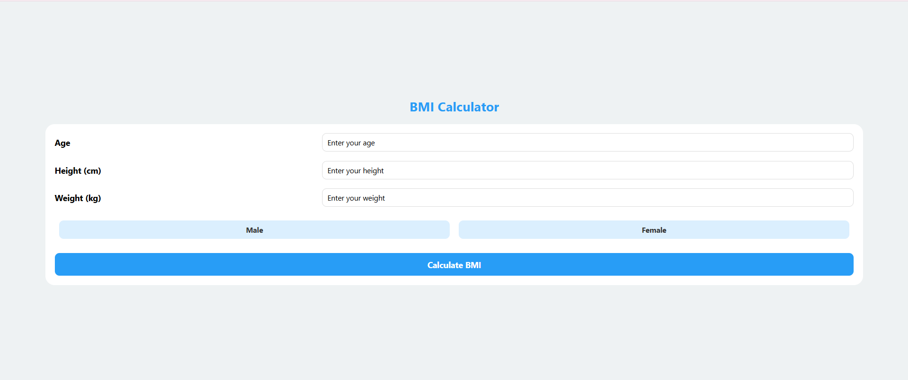
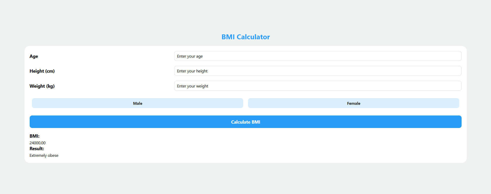

# BMI Calculator App

## Overview
The BMI Calculator App is a React Native project that allows users to calculate their BMI easily. 
## Features
- Simple and intuitive user interface.
- Calculate BMI based on height and weight inputs.
- Display BMI category (Underweight, Normal, Overweight, Obesity).
- Cross-platform compatibility (iOS, Android, Web).

## Technologies Used
- **React Native**: For building the app's interface.
- **Expo**: For development and testing.
- **JavaScript/TypeScript**: For app logic.

## Installation

1. **Clone the Repository**:
   ```bash
   git clone https://github.com/your-username/bmi-calculator-app.git
   cd bmi-calculator-app
   ```

2. **Install Dependencies**:
   ```bash
   npm install
   ```

3. **Start the Application**:
   - For web:
     ```bash
     expo start --web
     ```
   - For mobile (use the Expo Go app):
     ```bash
     expo start
     ```

## File Structure
```
BMIAPP/
|-- app/
|   |-- (tabs)/
|       |-- index.js    # Main file for the app tabs
|-- package.json        # Project dependencies
|-- tsconfig.json       # TypeScript configuration
```

## Development

### Adding New Features
1. Create a new branch for your feature:
   ```bash
   git checkout -b feature-name
   ```

2. Make your changes and commit:
   ```bash
   git add .
   git commit -m "Add new feature"
   ```

3. Push your branch:
   ```bash
   git push origin feature-name
   ```

### Testing the Application
- Run the app in development mode:
  ```bash
  expo start
  ```
- Test the app on a physical or virtual device using Expo Go or a browser.

## Contributing
We welcome contributions! Please fork the repository and create a pull request for any changes.

## License
This project is licensed under the MIT License. See the [LICENSE](LICENSE) file for details.

## Acknowledgments
Special thanks to the contributors and the open-source community for their support.

---

### Screenshots


